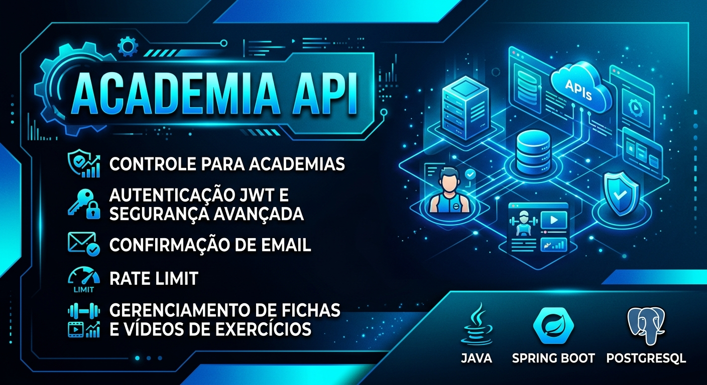

<p align="center">
  
</p>

<p align="center">
  <strong>API REST para gerenciamento de academias, fichas de treino e exercícios.</strong>
</p>

<p align="center">
  
  
  
  
  
  
</p>

---

# 🏋️ Sobre o projeto

A **Academia API** é uma API REST desenvolvida em **Java e Spring Boot** para gerenciamento de informações relacionadas a academias, personal trainers, alunos e fichas de treino.

O sistema permite que usuários com diferentes níveis de acesso realizem operações específicas dentro da plataforma.

Um dos principais recursos é a possibilidade de um usuário com papel de **Personal Trainer** criar fichas de treino e associar exercícios a elas, incluindo vídeos demonstrativos armazenados em um banco de vídeos integrado ao PostgreSQL.

O projeto também possui uma camada de segurança mais robusta, contando com recursos como **autenticação JWT, confirmação de e-mail, controle de acesso e rate limiting**.

---

# ✨ Funcionalidades

## 🔐 Autenticação e segurança

O projeto possui mecanismos voltados para proteger a API e controlar o acesso aos recursos.

- 🔑 Autenticação utilizando JWT.
- 📧 Confirmação de e-mail.
- 🛡️ Controle de acesso baseado em papéis.
- 🚦 Rate Limiting.
- 🔒 Proteção de endpoints.
- 👤 Gerenciamento de usuários.
- 🎫 Controle de sessão através de tokens.

---

# 👥 Controle de acesso

A aplicação trabalha com diferentes níveis de permissão.

Um dos principais papéis do sistema é o:

### 🏋️ Personal Trainer

O usuário com papel de personal pode:

- Criar fichas de treino.
- Gerenciar fichas.
- Adicionar exercícios.
- Associar exercícios às fichas.
- Adicionar vídeos demonstrativos aos exercícios.

A utilização de papéis permite restringir funcionalidades de acordo com as permissões do usuário.

```text
                  👤 Usuário
                      │
                      ▼
               🔐 Autenticação
                      │
                      ▼
               🛡️ Autorização
                      │
              ┌───────┴───────┐
              ▼               ▼
          👤 Aluno       🏋️ Personal
                              │
                              ▼
                       📋 Fichas de treino
                              │
                              ▼
                         🏃 Exercícios
                              │
                              ▼
                         🎥 Vídeos
```

---

# 📋 Fichas de treino

Os personal trainers podem criar fichas de treino para organizar os exercícios.

Uma ficha pode representar uma estrutura de treinamento contendo diferentes exercícios.

```text
🏋️ PERSONAL TRAINER
        │
        ▼
📋 FICHA DE TREINO
        │
        ├── 🏃 Exercício 1
        │      └── 🎥 Vídeo
        │
        ├── 🏃 Exercício 2
        │      └── 🎥 Vídeo
        │
        └── 🏃 Exercício 3
               └── 🎥 Vídeo
```

---

# 🎥 Banco de vídeos

Um dos diferenciais do projeto é a utilização de um **banco de vídeos integrado ao PostgreSQL**.

Os vídeos podem ser associados aos exercícios para auxiliar na demonstração de sua execução.

Isso permite que uma ficha de treino não seja apenas uma lista de exercícios, mas também possua recursos visuais para auxiliar o usuário.

---

# 🛡️ Segurança

A segurança é uma das principais características da aplicação.

## 🔑 JWT

A autenticação utiliza **JSON Web Token (JWT)** para identificar usuários e proteger recursos da API.

Fluxo simplificado:

```text
┌───────────────┐
│    Usuário    │
└───────┬───────┘
        │
        │ Login
        ▼
┌───────────────────┐
│  Authentication   │
└─────────┬─────────┘
          │
          │ JWT
          ▼
┌───────────────────┐
│      Cliente      │
└─────────┬─────────┘
          │
          │ Bearer Token
          ▼
┌───────────────────┐
│  Spring Security  │
└─────────┬─────────┘
          │
          ▼
    Endpoint protegido
```

---

## 📧 Confirmação de e-mail

O sistema possui um mecanismo de confirmação de e-mail durante o processo de cadastro.

O objetivo é adicionar uma camada adicional de segurança e validação da conta do usuário.

---

## 🚦 Rate Limiting

A API também utiliza **Rate Limiting** para limitar a quantidade de requisições realizadas em determinados intervalos.

```text
Cliente
   │
   │ Requisições
   ▼
┌──────────────────┐
│   Rate Limiter   │
└────────┬─────────┘
         │
     ┌───┴───┐
     ▼       ▼
   Permitido  Limite
     │       excedido
     ▼         │
    API        ▼
             🚫
```

Esse mecanismo ajuda a reduzir abusos e proteger os recursos da aplicação.

---

# 🏗️ Arquitetura

A aplicação segue uma arquitetura baseada na separação de responsabilidades:

```text
┌──────────────────────┐
│       Cliente        │
└──────────┬───────────┘
           │
           ▼
┌──────────────────────┐
│     Controllers      │
└──────────┬───────────┘
           │
           ▼
┌──────────────────────┐
│      Services        │
└──────────┬───────────┘
           │
           ▼
┌──────────────────────┐
│     Repositories     │
└──────────┬───────────┘
           │
           ▼
┌──────────────────────┐
│     PostgreSQL       │
└──────────────────────┘
```

A camada de segurança atua durante o fluxo das requisições:

```text
Request
   │
   ▼
🔐 Security
   │
   ├── JWT
   ├── Autorização
   ├── Rate Limit
   └── Validações
   │
   ▼
Controller
   │
   ▼
Service
   │
   ▼
Repository
   │
   ▼
PostgreSQL
```

---

# 🛠️ Tecnologias

| Tecnologia | Utilização |
|---|---|
| ☕ Java | Linguagem principal |
| 🌱 Spring Boot | Desenvolvimento da API |
| 🔐 Spring Security | Segurança e autorização |
| 🎫 JWT | Autenticação |
| 📧 E-mail | Confirmação de contas |
| 🚦 Rate Limiting | Controle de requisições |
| 🐘 PostgreSQL | Banco de dados |
| 📦 Maven | Gerenciamento de dependências |

---

# 🧠 Conceitos praticados

Durante o desenvolvimento foram trabalhados conceitos importantes de backend:

- ☕ Programação em Java.
- 🌐 Desenvolvimento de APIs REST.
- 🌱 Spring Boot.
- 🔐 Spring Security.
- 🎫 Autenticação JWT.
- 🛡️ Autorização baseada em papéis.
- 📧 Confirmação de e-mail.
- 🚦 Rate Limiting.
- 🗃️ Persistência de dados.
- 🐘 PostgreSQL.
- 📋 Regras de negócio.
- 🏋️ Gerenciamento de fichas de treino.
- 🎥 Gerenciamento de vídeos.
- 🔒 Desenvolvimento de aplicações com foco em segurança.

---

# 🚀 Como executar

## 📋 Pré-requisitos

Antes de executar o projeto, certifique-se de possuir:

- ☕ JDK compatível com o projeto.
- 📦 Maven.
- 🐘 PostgreSQL.
- Git.

---

## 1. Clone o repositório

```bash
git clone https://github.com/Heitor-Souza-Pacheco/academia.git
```

Entre na pasta:

```bash
cd academia
```

---

## 2. Configure o banco de dados

Crie um banco PostgreSQL para a aplicação.

Depois configure as credenciais utilizadas pelo projeto de acordo com o arquivo de configuração da aplicação.

> ⚠️ Nunca publique senhas, tokens ou outras credenciais diretamente no repositório.

---

## 3. Execute a aplicação

Caso o projeto utilize Maven Wrapper:

### Windows

```bash
mvnw.cmd spring-boot:run
```

### Linux / macOS

```bash
./mvnw spring-boot:run
```

Ou execute a classe principal da aplicação através da sua IDE.

---

# 📡 API

A aplicação funciona como backend para uma plataforma de gerenciamento de academia.

```text
                    📱 CLIENTE
                        │
                        ▼
                 ⚙️ ACADEMIA API
                        │
          ┌─────────────┼─────────────┐
          ▼             ▼             ▼
      👤 Usuários    🏋️ Personal   📋 Fichas
          │             │             │
          │             ▼             ▼
          │         🏃 Exercícios   🎥 Vídeos
          │
          └─────────────┬─────────────┘
                        ▼
                   🐘 PostgreSQL
```

---

# 📂 Estrutura do projeto

A estrutura pode ser organizada de acordo com as responsabilidades da aplicação:

```text
academia/
│
├── assets/
│   └── academiabanner.png
│
├── src/
│   ├── main/
│   │   ├── java/
│   │   └── resources/
│   │
│   └── test/
│
├── .gitignore
├── pom.xml
├── Dockerfile
└── README.md
```

---

# 🎯 Objetivos do projeto

O projeto foi desenvolvido com o objetivo de criar uma API capaz de atender às necessidades de uma plataforma de gerenciamento de academias.

Entre os objetivos estão:

- Gerenciar usuários.
- Controlar diferentes níveis de acesso.
- Permitir que personal trainers criem fichas.
- Organizar exercícios.
- Associar vídeos aos exercícios.
- Armazenar informações utilizando PostgreSQL.
- Implementar autenticação segura.
- Implementar confirmação de e-mail.
- Aplicar mecanismos de proteção contra excesso de requisições.

---

# 📚 Aprendizados

O desenvolvimento deste projeto proporcionou experiência prática em conceitos mais avançados de desenvolvimento backend.

Entre os principais aprendizados estão:

- Construção de APIs REST com Spring Boot.
- Implementação de autenticação JWT.
- Utilização do Spring Security.
- Implementação de autorização baseada em papéis.
- Desenvolvimento de confirmação de e-mail.
- Implementação de Rate Limiting.
- Criação de regras de negócio.
- Modelagem de dados utilizando PostgreSQL.
- Desenvolvimento de sistemas de gerenciamento de fichas.
- Integração de vídeos aos exercícios.
- Aplicação de práticas de segurança em APIs.

---

# 🔮 Próximos passos

Possíveis evoluções para o projeto:

- [ ] Documentação completa com Swagger/OpenAPI.
- [ ] Adicionar testes automatizados.
- [ ] Aumentar a cobertura de testes.
- [ ] Melhorar monitoramento da API.
- [ ] Adicionar logs estruturados.
- [ ] Implementar métricas de utilização.
- [ ] Melhorar gerenciamento do banco de vídeos.
- [ ] Adicionar sistema completo de alunos e personal trainers.
- [ ] Criar frontend/mobile para consumo da API.
- [ ] Realizar deploy em produção.

---

# 👨‍💻 Desenvolvedor

## Heitor Souza Pacheco

Estudante de Ensino Médio Técnico em Informática e desenvolvedor interessado em **Java, Spring Boot, APIs REST, segurança e desenvolvimento de software**.

<p align="center">
  <a href="https://github.com/Heitor-Souza-Pacheco">
    
  </a>
  <a href="https://linkedin.com/in/heitor-souza-pacheco">
    
  </a>
</p>

---

<p align="center">
  ⭐ Se este projeto foi interessante, considere deixar uma estrela!
</p>
